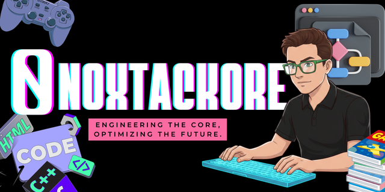
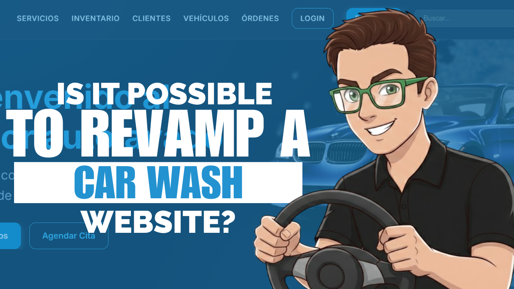
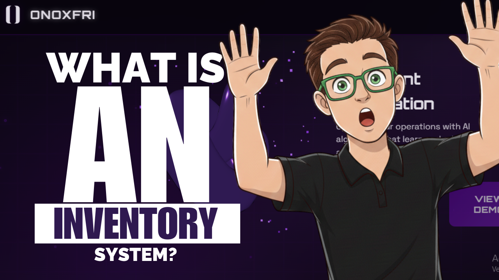
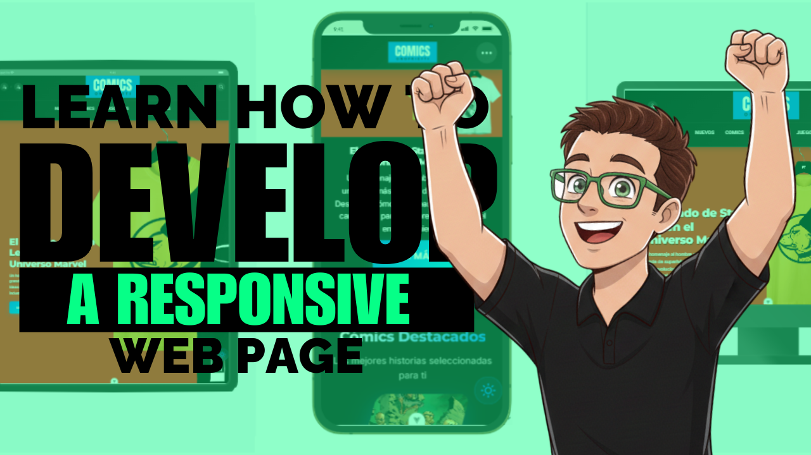

<h1 align="center">Hi, my name is <a href="https://aristi.dev">0noxtackore</a> 👋</h1>

  

## Development and Languages 👨🏻‍💻

  

## Databases 🗄️

  

## *Featured* Projects
<table>
<tr>
  <td width="50%">
    <h3 align="center">Radio Ebenezer Online</h3>
    

      
      

        
        
      

      
A specialized <strong>Web App interface</strong> for the Radio Ebenezer broadcasting system. Designed for large-scale displays with high-readability UI and real-time content updates.

    

  </td>

  <td width="50%">
    <h3 align="center">SERVI-WASH: Advanced Car Wash UI</h3>
    

      
      

        
        
      

      
A <strong>comprehensive web management system</strong> for car wash businesses, featuring optimized user experience (UX), service tracking, and digital scheduling.

    

  </td>
</tr>
<tr>
<td width="50%">
<h3 align="center">Ebenezer Screen System</h3>

A specialized <strong>Web App interface</strong> designed for large-scale displays. It focuses on high-readability UI and real-time content management.

</td>

<td width="50%">
<h3 align="center">Fluffy Adventures (Engine)</h3>

A <strong>Python-based game prototype</strong> exploring core game logic, state management, and asset rendering. Designed with modular architecture.

</td>
</tr>

<tr>
<td width="50%">
<h3 align="center">OnoxFri V1.1</h3>

Advanced <strong>Mobile Development</strong> project focused on performance and clean architecture. Implements modern Android patterns.

</td>

<td width="50%">
<h3 align="center">Onofrietti Comics Official</h3>

A <strong>Multiplatform Web Hub</strong> for comic distribution. Integrates responsive web design with a focus on visual storytelling.

</td>
</tr>

<tr>
<td width="50%">
<h3 align="center">Lithay Catalog System</h3>

A professional <strong>Digital Catalog Solution</strong> designed for product showcasing. Features a responsive layout and optimized search system.

</td>

<td width="50%">
<h3 align="center">Eticamix Manager</h3>

An innovative <strong>Management & Ethics Platform</strong>. Focuses on structured data handling, ensuring data integrity and security.

</td>
</tr>
</table>

### GitHub Analytics

